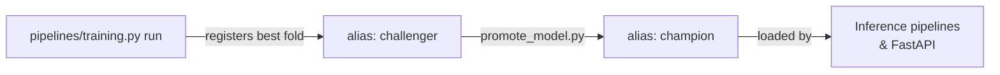

# Commands Reference

All commands are run from the **project root** unless stated otherwise.

---

## Table of Contents

1. [Prerequisites](#1-prerequisites)
2. [MLflow Server](#2-mlflow-server)
3. [Data Preparation](#3-data-preparation)
4. [Training](#4-training)
5. [Model Registry — Aliases](#5-model-registry--aliases)
6. [Inference](#6-inference)
7. [FastAPI Serving](#7-fastapi-serving)
8. [Testing / Smoke Tests](#8-testing--smoke-tests)
9. [Metaflow Cards](#9-metaflow-cards)

---

## 1. Prerequisites

### Create and activate a virtual environment

```bash
# With uv (recommended)
uv venv
source .venv/bin/activate

# Or with plain Python
python -m venv .venv
source .venv/bin/activate
```

### Install dependencies

```bash
# With uv
uv pip install -r requirements.txt

# Or with pip
pip install -r requirements.txt
```

### Configure environment variables

Copy `.env` to your working directory (already present) and ensure `MLFLOW_TRACKING_URI` is set.
The canonical value used by all scripts is `http://127.0.0.1:5001`:

```bash
# .env
MLFLOW_TRACKING_URI=http://127.0.0.1:5001
```

> **Port note:** `pipelines/training.py` and `scripts/promote_model.py` default to port `8080`
> in their argparse/Parameter defaults, but the `.env` file and most scripts hardcode `5001`.
> Always set `MLFLOW_TRACKING_URI` in your environment so every script uses the same server.

---

## 2. MLflow Server

Start the server before running any training, inference, or promotion commands.

### Start the server

```bash
mlflow server \
  --backend-store-uri sqlite:///mlflow.db \
  --default-artifact-root ./mlruns \
  --host 127.0.0.1 \
  --port 5001
```

### Open the UI

```bash
open http://127.0.0.1:5001
```

### Create the experiment (one-time setup)

```bash
mlflow experiments create -n "bank_churn_prediction"
```

---

## 3. Data Preparation

### Split raw training data into train / test sets

Reads `data/train.csv` and writes the 20% holdout to `data/test.csv`.

```bash
python scripts/split_data.py
```

### Preprocess raw data and save processed CSV

Runs `preprocess_data` and saves the result to `data/processed/bank_churn_processed.csv`.

```bash
python scripts/prepare_processed_data.py

# Override the input file path (default: data/train.csv)
BANK_RAW_DATA=data/my_raw.csv python scripts/prepare_processed_data.py
```

---

## 4. Training

### Metaflow training pipeline

Full cross-validated training pipeline with MLflow tracking, model registration, and Metaflow cards.

```bash
python pipelines/training.py run
```

**All parameters:**

| Parameter | Default | Description |
|---|---|---|
| `--dataset_dir` | `data/` | Directory scanned for `*train.csv` files |
| `--dataset_file` | `""` | Single file path (overrides `--dataset_dir`) |
| `--n_splits` | `5` | Number of cross-validation folds |
| `--seed` | `42` | Random seed |
| `--mlflow_tracking_uri` | `http://127.0.0.1:8080` | MLflow server URI (override via `MLFLOW_TRACKING_URI`) |
| `--model_type` | `xgboost` | `"xgboost"` or `"catboost"` |
| `--depth` | `4` | CatBoost tree depth |
| `--learning_rate` | `0.1` | CatBoost learning rate |
| `--subsample` | `0.8` | CatBoost subsample ratio |
| `--l2_leaf_reg` | `1.0` | CatBoost L2 regularization |

**Examples:**

```bash
# Default run (XGBoost, 5-fold CV)
python pipelines/training.py run

# CatBoost with custom hyperparameters
python pipelines/training.py run \
  --model_type catboost \
  --depth 6 \
  --learning_rate 0.05 \
  --subsample 0.9 \
  --n_splits 3

# Point to a specific dataset file
python pipelines/training.py run --dataset_file data/train.csv

# Override MLflow URI via environment variable (recommended)
MLFLOW_TRACKING_URI=http://127.0.0.1:5001 python pipelines/training.py run
```

After a successful run the best fold is registered in the MLflow Model Registry with the
`challenger` alias. See [Model Registry](#5-model-registry--aliases) to promote it to `champion`.

---

### Simple training script (no Metaflow)

Single train/test split. Logs to MLflow but does **not** register to the Model Registry.
Defaults to local file-store MLflow (`file://<root>/mlruns`) when `--mlflow_uri` is not provided.

```bash
python scripts/run_pipeline.py
```

**All flags:**

| Flag | Default | Description |
|---|---|---|
| `--input` | `data/train.csv` | Path to training CSV |
| `--test_size` | `0.2` | Fraction of data held out for evaluation |
| `--experiment` | `bank_churn_prediction` | MLflow experiment name |
| `--mlflow_uri` | `None` → `file://<root>/mlruns` | MLflow tracking URI |
| `--model_type` | `xgboost` | `"xgboost"` or `"catboost"` |

**Examples:**

```bash
# Default (XGBoost, local mlruns)
python scripts/run_pipeline.py

# CatBoost against a running MLflow server
python scripts/run_pipeline.py \
  --model_type catboost \
  --mlflow_uri http://127.0.0.1:5001

# Custom split ratio and experiment name
python scripts/run_pipeline.py \
  --test_size 0.15 \
  --experiment my_experiment
```

---

### Direct CatBoost training script

Trains CatBoost with fixed hyperparameters. No CLI arguments.
Outputs:
- `models/catboost_model.pkl` — pickled model
- `model_run_id.txt` — MLflow run ID of the saved model

Requires MLflow running at `http://127.0.0.1:5001`.

```bash
python scripts/train_and_save_model.py
```

---

## 5. Model Registry — Aliases

The training pipeline assigns a `challenger` alias to the best model from each run.
Use `promote_model.py` to designate a version as `champion` — the alias all inference
pipelines load from.



### List all registered versions and aliases

```bash
python scripts/promote_model.py --list

# Override MLflow URI
python scripts/promote_model.py --list --mlflow-uri http://127.0.0.1:5001
```

### Promote the current challenger to champion

```bash
python scripts/promote_model.py --promote-challenger

# Override MLflow URI
python scripts/promote_model.py --promote-challenger --mlflow-uri http://127.0.0.1:5001
```

### Promote a specific version number to champion

```bash
python scripts/promote_model.py --version 5

# Override MLflow URI
python scripts/promote_model.py --version 5 --mlflow-uri http://127.0.0.1:5001
```

**All flags:**

| Flag | Default | Description |
|---|---|---|
| `--version <N>` | — | Version number to promote (mutually exclusive) |
| `--promote-challenger` | — | Promote the current `challenger` to `champion` (mutually exclusive) |
| `--list` | — | List all versions and aliases (mutually exclusive) |
| `--mlflow-uri` | `$MLFLOW_TRACKING_URI` or `http://127.0.0.1:8080` | MLflow server URI |

One of `--version`, `--promote-challenger`, or `--list` is required.

---

## 6. Inference

All inference commands load the model with the `champion` alias
(`models:/bank_churn_prediction@champion`). A champion must be promoted first — see
[Model Registry](#5-model-registry--aliases).

### Metaflow inference pipeline

```bash
python pipelines/inference.py run
```

**All parameters:**

| Parameter | Default | Description |
|---|---|---|
| `--input_data_path` | `data/test.csv` | Input CSV for inference |
| `--output_data_path` | `data/predictions.csv` | Output CSV with predictions |
| `--model_run_id` | `None` | Specific MLflow run ID; if omitted, auto-finds the latest finished run |

**Examples:**

```bash
# Default (reads data/test.csv, writes data/predictions.csv)
python pipelines/inference.py run

# Custom input/output paths
python pipelines/inference.py run \
  --input_data_path data/test.csv \
  --output_data_path data/my_predictions.csv

# With a specific model run ID
python pipelines/inference.py run \
  --model_run_id abc123def456

# Override MLflow URI
MLFLOW_TRACKING_URI=http://127.0.0.1:5001 python pipelines/inference.py run
```

---

### Simple inference script (no Metaflow)

No CLI arguments. Reads `data/test.csv`, loads the `@champion` model from
`http://127.0.0.1:5001`, writes predictions to `data/predictions.csv`.

```bash
python scripts/run_inference.py
```

---

## 7. FastAPI Serving

The API loads the `champion` model on startup via `src.serving.inference.load_model`.

### Development server (with auto-reload)

```bash
uvicorn src.app.main:app --reload
```

### Production server

```bash
uvicorn src.app.main:app --host 0.0.0.0 --port 8000 --workers 4
```

### Endpoints

| Method | Path | Description |
|---|---|---|
| `GET` | `/` | Health check — returns `{"status": "ok"}` |
| `POST` | `/predict` | Returns `{"prediction": 0\|1}` for a single customer |

### Sample POST /predict request

```bash
curl -X POST http://127.0.0.1:8000/predict \
  -H "Content-Type: application/json" \
  -d '{
    "CreditScore": 600,
    "Geography": "France",
    "Gender": "Male",
    "Age": 40,
    "Tenure": 3,
    "Balance": 100000.0,
    "NumOfProducts": 1,
    "HasCrCard": 1,
    "IsActiveMember": 1,
    "EstimatedSalary": 150000.0,
    "Surname": "Smith"
  }'
```

### Docker

```bash
# Build image
docker build -t bank-churn-api -f dockerfile .

# Run container
docker run -p 8000:8000 bank-churn-api

# With MLflow URI injected (for champion model loading)
docker run -p 8000:8000 \
  -e MLFLOW_TRACKING_URI=http://host.docker.internal:5001 \
  bank-churn-api
```

---

## 8. Testing / Smoke Tests

These scripts require no MLflow server and no trained model.

### Phase 1 — Data and feature pipeline

Validates load → preprocess → build_features.

```bash
python scripts/test_pipeline_phase1_data_features.py
```

### Phase 2 — Modeling pipeline

Trains on a 500-sample subset and evaluates. No MLflow logging.

```bash
python scripts/test_pipeline_phase2_modeling.py
```

### FastAPI smoke test

Sends a `GET /` and a `POST /predict` to a running FastAPI server.

```bash
# Requires the API to be running first (see section 7)
python scripts/test_fastapi.py

# Override the base URL (default: http://127.0.0.1:8000)
API_BASE=http://127.0.0.1:8000 python scripts/test_fastapi.py
```

---

## 9. Metaflow Cards

### Generate cards for the latest Training run

```bash
python generate_cards.py
```

### View a card for a specific run step

```bash
python pipelines/training.py card view <run_id>/<step_name>/1

# Example
python pipelines/training.py card view 12/register_model/1
```

### Create a card for a specific step pathspec

```bash
python pipelines/training.py card create <run_id>/<step_name>/1
```
